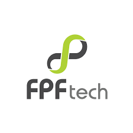
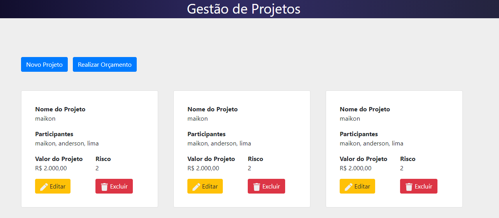
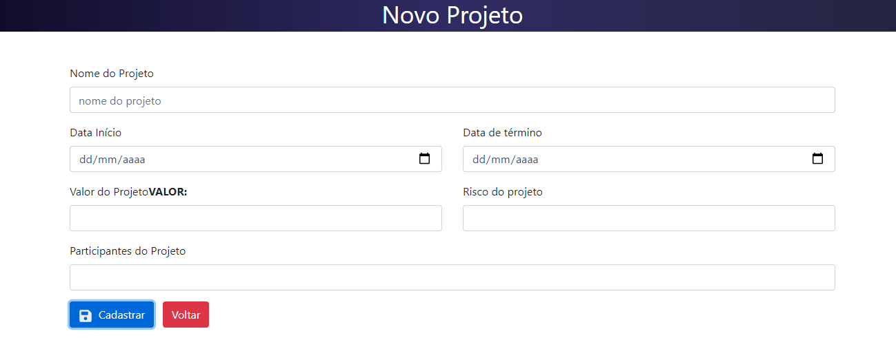
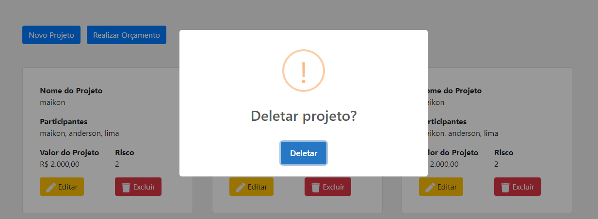

<h1 align="center">FPF_Tech - Desafio Técnico - GESTÃO DE PROJETOS</h1>

Desafio proposto foi desenvolver um gerenciador de projeto, contendo back-end, front-end e base de dados.

<h3>Ferramentas utilizadas</h3>
<ul>
  <li>Nodejs</li>
  <li>Knexjs</li>
  <li>Reactjs</li>
  <li>React Bootstrap</li>
  <li>MySQL</li>
</ul>

Antes de executar, são necessários os seguintes softwares instalados na máquina:

 <ul> 
  <li>Xampp ou Wampp.</li>
  <li>node.</li>
 </ul>
<h3>Execução do Projeto</h3>
<ul>
  <li>Faça clone do Projeto.</li>
</ul>
  
Em em seguida abra no editor de sua preferência.

  
Após o download, execute os seguintes comandos "npm install" e "npm start" nas pastas "backend" e "frontend", na pasta "backend" execute o comando "knex migrate:latest"
  para gerar a base de dados no MYSQL.

  
<h3>Acesso do sistema Web</h3>

http://localhost:3000/

  
  <h3 align="center">Visão do Sistema</h3>
  

   
  

  

   
  

  

    
  

